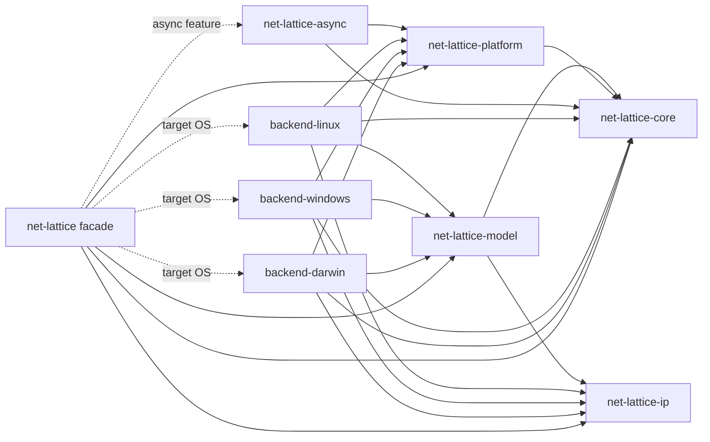

# Net Lattice project index

Net Lattice is a cross-platform Rust library for inspecting and configuring
operating-system networking through one strongly typed facade. The supported
platform backends are Linux, Windows, and macOS.

## Workspace map

```text
net-lattice/
├── crates/
│   ├── net-lattice-core/       Shared Error, Result, and typed IDs
│   ├── net-lattice-ip/         IPv4, IPv6, prefixes, and networks
│   ├── net-lattice-model/      Platform-independent observed/desired models
│   ├── net-lattice-platform/   Generic provider and capability contracts
│   ├── net-lattice-backend-linux/   Linux Netlink implementation
│   ├── net-lattice-backend-windows/ Windows IP Helper implementation
│   ├── net-lattice-backend-darwin/  macOS BSD/PF_ROUTE/ioctl implementation
│   ├── net-lattice-async/       Runtime-independent futures::Stream adapter
│   └── net-lattice/             Public facade, validation, and transaction executor
├── .github/workflows/           Cross-platform CI and privileged coverage jobs
├── .ai/<task-name>/             Ignored task plan, audit log, and ADRs
├── .codex/                      Reusable Codex rules, roles, and templates
├── scripts/                     Repository helper scripts
├── ARCHITECTURE.md              English architecture and roadmap
├── ARCHITECTURE.ru.md           Russian architecture and roadmap
├── README.md                    English user documentation
├── README.ru.md                 Russian user documentation
├── CHANGELOG.md                 Release history
├── SECURITY.md                  Vulnerability reporting policy
├── SUPPORT.md                   Support and project status
├── CONTRIBUTING.md              Contribution workflow
├── AGENTS.md                    Repository agent entry point
└── index.md                     This project map
```

## Dependency direction

Arrows mean “depends on”.



`net-lattice-platform` must remain independent of `net-lattice-model`.
The facade binds generic provider associated types to concrete model types.
Mutation data belongs in `net-lattice-model`; execution orchestration remains
an internal facade component until repeated reuse justifies a new crate.

## Current release and roadmap

Published stage baseline: the `net-lattice 0.15` release line. Read the current
workspace version from `crates/net-lattice/Cargo.toml`; do not duplicate a
patch version here.

- 0.1–0.14: completed inspection, monitoring, imperative mutation, and
  mutation-plan model stages.
- 0.15: completed ordered transaction execution, runtime preflight,
  cancellation, typed snapshots, explicit compensation, and phase-aware
  reports.
- 0.16: implementation complete pending privileged CI: desired `InterfaceConfig`,
  capability-gated MTU/admin-state mutation, read-after-write, and executor
  integration on all built-in backends.
- 0.17: planned neighbor mutation.
- 0.18: planned consistent `CurrentState` snapshots.
- 0.19: planned `DesiredState` and inspectable diff.
- 0.20: planned declarative apply through the transaction executor.
- 0.21: planned pre-1.0 compatibility and hardening audit.

The active Stage 0.16 plan and audit record remain in `.ai/0.16/` in the
working tree until privileged CI evidence closes its final checkbox.
`.ai/`, `.codex/`, this index, and root `AGENTS.md` are intentionally local
agent context in this checkout and are not release content.

## Stage 0.16 delivered contract

```text
observed Interface
        ▲
        │ read-after-write
InterfaceMutator ← InterfaceConfig intent
        │
        ├── MTU capability
        └── administrative-state capability
```

The implementation preserves the Stage 0.15 `ExecutionOptions` API and
explicit-compensation boundary, relies on existing native `Interface::Changed`
event mappings, and keeps ordinary tests non-privileged and non-destructive.
Privileged shared-runner tests validate native submission/readback/restoration;
destructive end-to-end event proof requires an isolated test interface.

## Useful commands

```text
cargo fmt --all -- --check
cargo test --workspace --all-features --exclude net-lattice-backend-linux
cargo clippy --workspace --all-targets --all-features -- -D warnings
cargo doc --workspace --all-features --no-deps
cargo package -p net-lattice --allow-dirty --list
git diff --check
```

Privileged backend tests are run by the platform CI jobs with the required
Linux capabilities, Windows administrator context, or macOS privileges.
